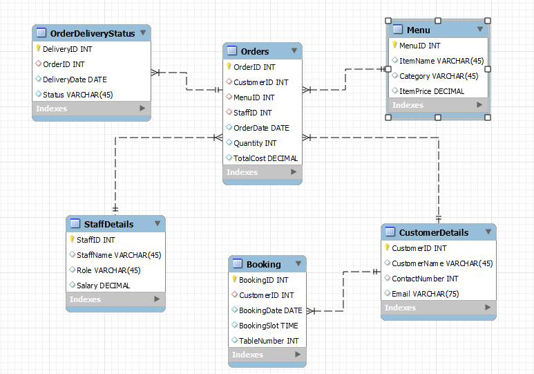
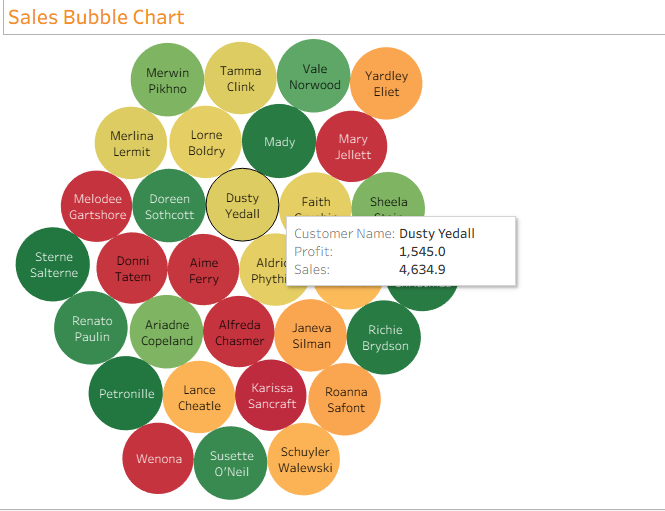
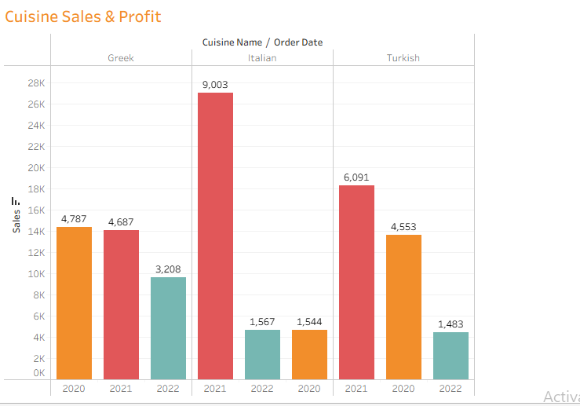

# 🍋 Little Lemon Database Capstone Project

## 📌 Project Overview
This repository contains my **Meta Database Engineer Capstone Project**, developed for the **Little Lemon Restaurant** case study.

The project demonstrates the complete workflow of:
- Designing a relational data model
- Implementing the database in MySQL
- Writing advanced SQL queries, views, and stored procedures
- Visualizing insights using Tableau
- Connecting a database client using Python and MySQL Connector

---

## 📂 Repository Structure

db-capstone-project/ │ 
|── images/ │   
   ├── ER-Diagram.png │  
   ├── 1-CustomerSales.png │   
   ├── 2-ProfitChart.png │   
   ├── 3-SalesBubbleChart.png │   
   ├── 4-CuisineSales&Profit.png │   
   └── 5-InteractiveDashboard.png  
   
├── Database_Client.ipynb 

├── ER DIGRAM.mwb 

├── LittleLemon-tableau.twbx 

├── LittleLemonDB.sql 

└── README.md

---

## 🧩 Phase 1: Data Model & ER Diagram

The project began with designing a **normalized relational data model** using **MySQL Workbench**.

Key entities:
- Customer Details
- Staff Details
- Menu
- Menu Items
- Orders
- Booking
- Order Delivery Status

### 📌 ER Diagram

The data model is saved as a MySQL Workbench file:
- **`ER DIGRAM.mwb`**

---

## 🛠 Phase 2: Database Implementation (MySQL)

The ER model was **forward engineered** into MySQL to create the database:

### 📌 Database Name
`LittleLemonDB`

### Implemented Features:
- Table creation with primary & foreign keys
- Referential integrity constraints
- Auto-incrementing primary keys
- Schema exported as a single SQL file

📄 **Database schema file:**  
`LittleLemonDB.sql`

---

## 🔍 Phase 3: SQL Queries, Views & Stored Procedures

Advanced SQL techniques were used to fulfill business requirements.

### ✔ Views
- `OrdersView`  
  Filters orders with **quantity > 2**

### ✔ Stored Procedures
- `GetMaxQuantity()`
- `CancelOrder()`
- `AddBooking()`
- `UpdateBooking()`
- `CancelBooking()`
- `CheckBooking()`
- `AddValidBooking()`

### ✔ Prepared Statements
- Parameterized queries to retrieve order details using `CustomerID`

### ✔ Subqueries & Joins
- Multi-table joins for customer order analysis
- Subqueries using the `ANY` operator to identify popular menu items

---

## 📊 Phase 4: Data Visualization (Tableau)

The database data was visualized using **Tableau** to extract meaningful insights.

### 📌 Charts Created
- Customer sales bar chart (sales ≥ $70)
- Profit line chart for year 2019-2022
- Sales bubble chart of each customer
- Cuisine Sales & Profit bar chart for year 2020-2022
- 
#### Sample Charts

### 📌 Interactive Dashboard

📄 **Tableau Workbook:**  
`LittleLemon-tableau.twbx`

---

## 🐍 Phase 5: Database Client using Python

A database client was built using **Python and MySQL Connector** inside Jupyter Notebook.

### Features:
- Connects Python to MySQL
- Executes SQL queries programmatically
- Displays query results

📄 **Notebook file:**  
`Database_Client.ipynb`

---

## 🧠 Tools & Technologies Used

- MySQL Server
- MySQL Workbench
- SQL
- Python
- MySQL Connector
- JupyterLab
- Tableau
- Git & GitHub

---

## ✅ Learning Outcomes

- Designed a complete relational database system
- Implemented advanced SQL queries and stored procedures
- Built reusable database logic
- Connected Python applications to MySQL
- Created professional data visualizations
- Managed a structured GitHub repository

---
